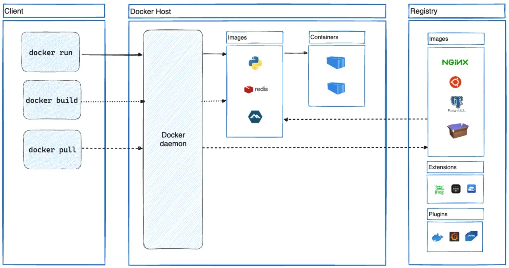
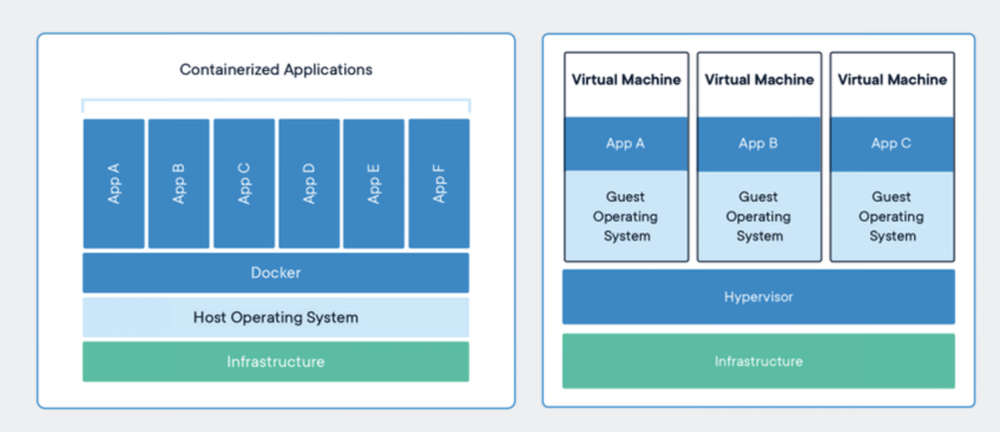

# Arsitektur Docker Container terdiri dari : 

1. Docker Client : Interface CLI yang digunakan untuk berkomunikasi dengan dockerd
2. Docker Daemon (dockerd) : Yang mendengar request client melalui docker API. Dimana dockerd juga yang bertanggungjawab atas mengelola object seperti images, containers, network dan volume
3. Docker Registry : Repo dari images
4. Images : Sebuah template yang bersifat read-only yang digunakan untuk membuat container. 1 images dapat digunakan di beberapa kontainer
5. Container : Instance dari image yang berjalan 

# Virtual Machine VS Docker Container

Virtualisasi bermain dalam level Hardware, yang mana akan membagi resource menjadi beberapa suatu komputasi/OS, sedangkan Docker bermain dalam level Sistem operasi. Dengan docker kita tidak membuat guest OS, karna hanya berbagi kernel dari host OS. Berbeda dengan Virtual machine, yang membuat guest OS di atas host OS yang akan 

# CLI for menage container, volume, and network

- docker container [option]
    - attach
    - commit
    - cp
    - create
    - diff
    - export
    - inspect
    - kill
    - logs
    - pause
    - port
    - prune
    - rename
    - restart
    - rm
    - start
    - stats
    - stop
    - top
    - unpause
    - update
    - wait
    - exec
    - ls
    - run
- docker volume [option]
    - create
    - inspect
    - ls
    - prune
    - rm
    - update
- docker network [option]
    - connect
    - create
    - disconnect
    - inspect
    - ls
    - prune
    - rm
