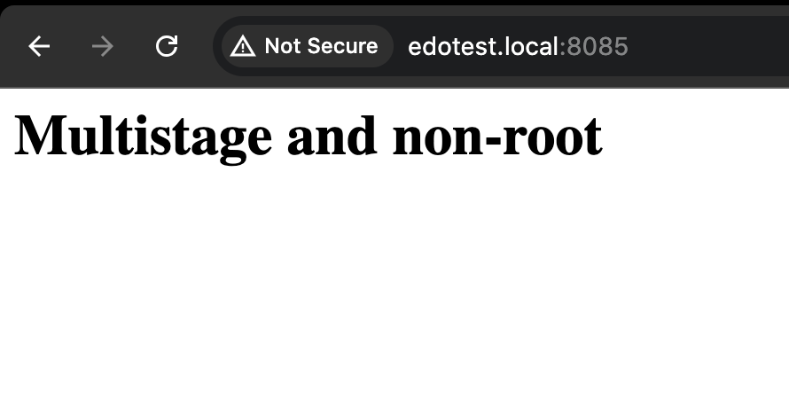

## Create Dockerfile with implementing multistage and non-root user

### In this case we will use nginx and node images

1. Create new file with name `package.json`
```shell
{
  "name": "my-websiste",
  "version": "1.0.0",
  "description": "Simple Webapps",
  "main": "index.js",
  "scripts": {
    "test": "echo \"Error: no test specified\" && exit 1"
  },
  "author": "Dimas Maryanto",
  "license": "MIT",
  "dependencies": {
    "jquery": "3.2.1",
    "materialize-css": "0.100.2"
  }
}
```
2. Create new index.html
```shell
<html>
  <head>
    <title>LEARN Module 1!</title>
  </head>
  <body>
    <h1>Multistage and non-root</h1>
  </body>
</html>
```
3. Create build.Dockerfile
```shell
FROM node:16-alpine3.11

WORKDIR /sources
COPY package.json .
RUN npm install --prod
```
4. Build the image
```shell
docker build -f build.Dockerfile -t nodetest .
```
5. Create the container without running and copy the node_modules
```shell
docker create --name extract nodetest
docker container cp extract:/sources/node_modules .
```
6. Now you have node_modules directory in your local

7. Create file `nginx.conf`
```shell
worker_processes  auto;

error_log  /var/log/nginx/error.log notice;
pid        /var/run/nginx.pid;


events {
    worker_connections  1024;
}


http {
    include       /etc/nginx/mime.types;
    default_type  application/octet-stream;

    log_format  main  '$remote_addr - $remote_user [$time_local] "$request" '
                      '$status $body_bytes_sent "$http_referer" '
                      '"$http_user_agent" "$http_x_forwarded_for"';

    access_log  /var/log/nginx/access.log  main;

    sendfile        on;
    #tcp_nopush     on;

    keepalive_timeout  65;

    #gzip  on;

    include /etc/nginx/conf.d/*.conf;
}
```
8. Create Dockerfile with multistage and non-root user
```shell
FROM node:16-alpine3.11 as builder

WORKDIR /sources
COPY package.json .
RUN npm install --prod

FROM nginx:1.20 
COPY nginx.conf /etc/nginx/nginx.conf  
COPY index.html /usr/share/nginx/html/index.html
COPY --from=builder /sources/node_modules /usr/share/nginx/html/node_modules/
WORKDIR /app
RUN chown -R nginx:nginx /app && chmod -R 755 /app && \
        chown -R nginx:nginx /var/cache/nginx && \
        chown -R nginx:nginx /var/log/nginx && \
        chown -R nginx:nginx /etc/nginx/conf.d
RUN touch /var/run/nginx.pid && \
        chown -R nginx:nginx /var/run/nginx.pid
USER nginx
EXPOSE 80
CMD ["nginx", "-g", "daemon off;"]
```
9. Build the image
```shell
docker build -t nginx_multistage-non-root .
```
10. Running the image as a container 
```shell
docker run -d --name nginx_multistage-non-root -p 8085:80 nginx_multistage-non-root
```
## The Result


