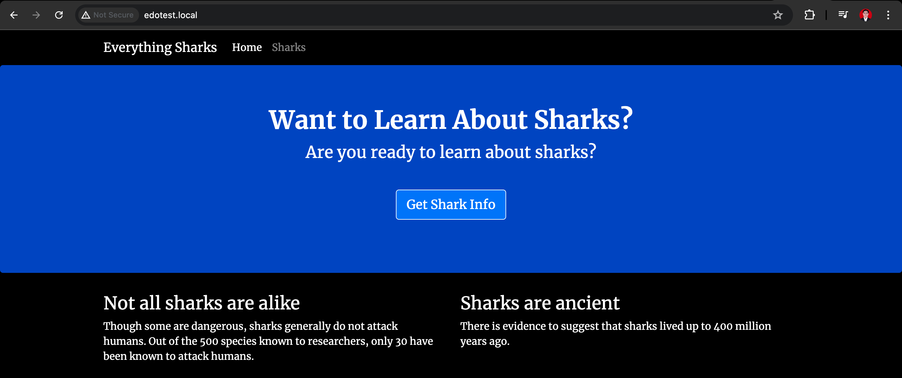

## Create Multiple container using docker compose with simple Node Application and nginx as reverse proxy


1. Clone Node Application 
```shell
git clone https://github.com/do-community/nodejs-image-demo.git node_project
```
2. Change to the node_project directory and i make a few changes to the dockerfile
```shell
FROM node:10-alpine
RUN mkdir -p /home/node/app/node_modules
WORKDIR /home/node/app
COPY package*.json ./
RUN npm install
COPY . .
EXPOSE 8080
CMD [ "node", "app.js" ]
```
3. Build the image
```shell
docker build -t node-app .
```
4. Build the container
```shell
docker run --name node-app -p 80:8080 -d node-app
```

### Test


5. After tested the application, we can stop and remove the container
```shell
docker stop container_id
docker rm container_id
docker image rm node-app
```

## Defining the Web Server Configuration
6. Create directory nginx-conf and nginx.conf inside of it
```shell
server {
        listen 80;
        listen [::]:80;

        root /var/www/html;
        index index.html index.htm index.nginx-debian.html;

        server_name edotest.local www.edotest.local;

        location / {
                proxy_pass http://nodejs:8080;
        }

        location ~ /.well-known/acme-challenge {
                allow all;
                root /var/www/html;
        }
}
```
7. Create docker-compose.yml
```shell
version: '3'

services:
  nodejs: #define application service
    build:
      context: .
      dockerfile: Dockerfile
    image: nodejs
    container_name: nodejs
    restart: unless-stopped
    networks:
      - app-network
  webserver: #define web server service
    image: nginx:mainline-alpine
    container_name: webserver
    restart: unless-stopped
    ports:
      - "80:80"
    volumes:
      - ./nginx-conf:/etc/nginx/conf.d
    depends_on:
      - nodejs
    networks:
      - app-network
networks: #define bridge network called app-network to  enable communication between the application and web server containers 
  app-network:
    driver: bridge
```
6. Start the container
```shell
docker-compose up -d
```

## The Result


