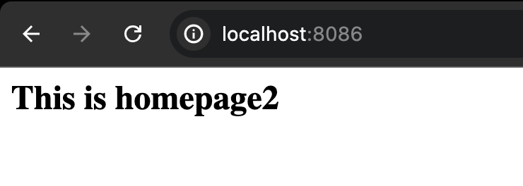

## Create container with nginx application, with adding network, mapping port, and binding volume

1. Create index.html inside our path project
```shell
<html>
  <head>
    <title>LEARN Module 1</title>
  </head>
  <body>
    <h1>This is homepage2</h1>
  </body>
</html>
```
2. Create Network (ex. web1 is the network name)
```shell
docker network create web1
```
3. Get the network
```shell
docker network ls
```
4. Create dockerfile
```shell
FROM nginx:1.10.1-alpine
EXPOSE 80
CMD ["nginx", "-g", "daemon off;"]
```
5. Build the image
```shell
docker build -t nginx-bind-volume .
```
6. Create the container with the network and binding to out local path project  
```shell
docker run -d --network web1 --name nginx_bind_volume_2 -v /path/project/bind_volume:/usr/share/nginx/html:ro -p 8086:80 -d nginx-bind-volume
```
## The Result


