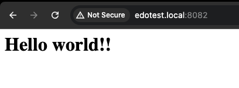
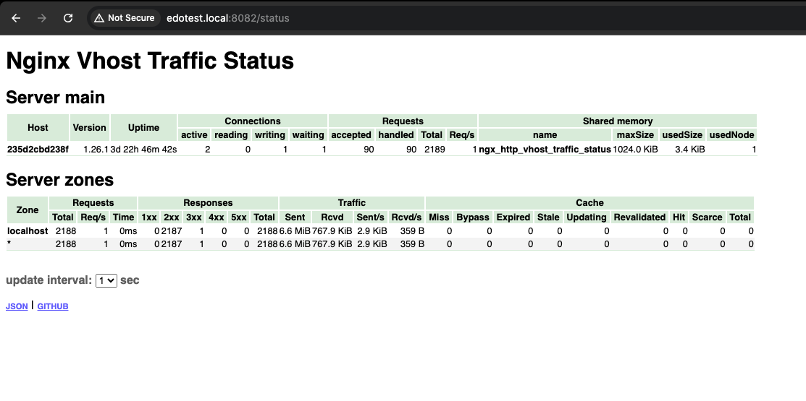

## Create a little bit complex dockerfile, build nginx from source and add some module (ex. nginx-module-vts)

1. Create new directory with name project
2. Create new index.html inside of content directory
```shell
<html>
  <head>
    <title>LEARN Module 1</title>
  </head>
  <body>
    <h1>Hello world!!</h1>
  </body>
</html>
```
3. Create nginx.conf
```shell
user  www-data;
worker_processes  1;

events {
    worker_connections  1024;
}

http {
    include       mime.types;
    default_type  application/octet-stream;

    sendfile        on;
    keepalive_timeout  65;

    vhost_traffic_status_zone;

    server {
        listen       80;
        server_name  localhost;

        location / {
            root   /var/www/html;
            index  index.html index.htm;
        }

        location /status {
            vhost_traffic_status_display;
            vhost_traffic_status_display_format html;
        }

        error_page   500 502 503 504  /50x.html;
        location = /50x.html {
            root   html;
        }
    }
}
```
4. Create dockerfile
```shell
FROM debian:bookworm-slim

RUN apt-get update && \
    apt-get install -y \
    build-essential \
    libpcre3 \
    libpcre3-dev \
    zlib1g \
    zlib1g-dev \
    libssl-dev \
    wget \
    git

ENV NGINX_VERSION 1.26.1
#ENV VTS_MODULE_VERSION 0.1.18

RUN wget http://nginx.org/download/nginx-${NGINX_VERSION}.tar.gz && \
    tar -zxvf nginx-${NGINX_VERSION}.tar.gz

RUN git clone https://github.com/vozlt/nginx-module-vts.git

WORKDIR /nginx-${NGINX_VERSION}
RUN ./configure --with-compat --add-module=../nginx-module-vts && \
    make && \
    make install

WORKDIR /
RUN rm -rf /nginx-${NGINX_VERSION} /nginx-${NGINX_VERSION}.tar.gz /nginx-module-vts

COPY nginx.conf /usr/local/nginx/conf/nginx.conf
COPY project/index.html /var/www/html/index.html

EXPOSE 80

CMD ["/usr/local/nginx/sbin/nginx", "-g", "daemon off;"]
```
5. Build the image
```shell
docker build -t nginx_custom .
```
6. Running the image as a container 
```shell
docker run -d --name nginx_with_vts_module -p 8082:80 nginx_custom
```
## The Result




